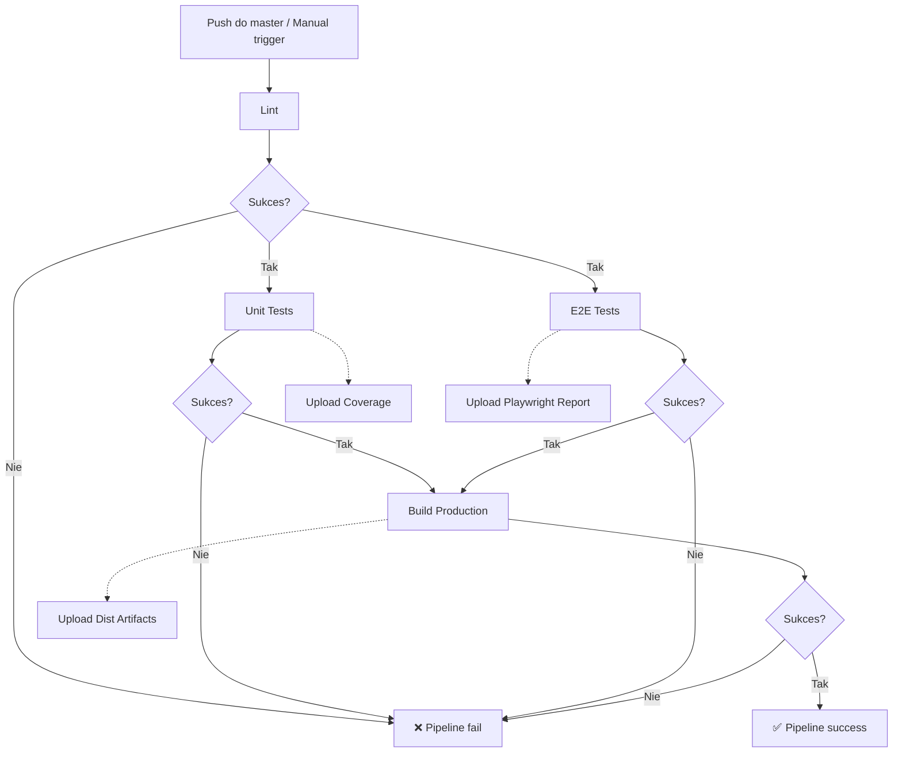

# Architektura CI/CD Pipeline

## Przepływ prac



## Szczegóły jobów

### 1. Lint Job

- **Czas**: ~1 min
- **Cache**: npm dependencies
- **Komendy**: `npm run lint`
- **Fail-fast**: Tak (blokuje następne joby)

### 2. Unit Tests Job

- **Czas**: ~2 min
- **Zależności**: Lint (needs: lint)
- **Komendy**: `npm run test:run`
- **Coverage threshold**: 70%
- **Artifacts**: coverage-report (7 dni)

### 3. E2E Tests Job

- **Czas**: ~3-5 min
- **Zależności**: Lint (needs: lint)
- **Browser**: Chromium only (dla szybkości)
- **Zmienne środowiskowe**:
  - SUPABASE_URL
  - SUPABASE_ANON_KEY
  - SUPABASE_SERVICE_ROLE_KEY
  - TEST_USER_EMAIL
  - TEST_USER_PASSWORD
- **Artifacts**: playwright-report (7 dni)
- **Timeouts**:
  - Test: 90s
  - Expect: 15s
  - Action: 30s
  - Navigation: 45s

### 4. Build Job

- **Czas**: ~2 min
- **Zależności**: Unit Tests + E2E Tests (needs: [test-unit, test-e2e])
- **Komendy**: `npm run build`
- **Output**: dist/
- **Artifacts**: dist (7 dni)
- **Zmienne środowiskowe**:
  - SUPABASE_URL
  - SUPABASE_ANON_KEY

## Optymalizacje

### Równoległość

- Unit i E2E testy uruchamiają się równolegle po lincie
- Oszczędza ~3-5 min w porównaniu do sekwencyjnego wykonania

### Cache

- npm dependencies są cache'owane przez `actions/setup-node@v6`
- Przyspiesza instalację o ~30-60s przy każdym jobie

### Artifacts retention

- Wszystkie artifacts przechowywane przez 7 dni
- Automatyczne czyszczenie po tym czasie
- Kompresja artifacts (level 6) zmniejsza rozmiar o ~40-60%

### Concurrency control

- `cancel-in-progress: true` - anuluje poprzednie uruchomienia dla tego samego branch
- Oszczędza minuty CI/CD i zasoby gdy pushujemy kilka commitów pod rząd

### Timeouts

- Lint: 5 min (normalnie ~1 min)
- Unit Tests: 10 min (normalnie ~2 min)
- E2E Tests: 20 min (normalnie ~3-5 min)
- Build: 10 min (normalnie ~2 min)
- Zapobiega nieskończonym hangom

### Security

- Minimalne permissions (contents: read, actions: read)
- Zmienne środowiskowe na poziomie jobów, nie globalnie
- Secrets nigdy nie są logowane

## Monitoring i Debugowanie

### Logi

Każdy job generuje szczegółowe logi dostępne w zakładce Actions.

### Artifacts

Po zakończeniu pipeline możesz pobrać:

1. **coverage-report**: HTML raport z pokryciem kodu
2. **playwright-report**: HTML raport z testami E2E + screenshots/videos failów
3. **dist**: Gotowy build produkcyjny

### Retry strategy

- E2E testy: 2 retry w CI, 1 lokalnie
- Inne: Brak retry (fail-fast)

## Bezpieczeństwo

### Secrets

Wszystkie wrażliwe dane przechowywane jako GitHub Secrets:

- Nigdy nie logowane w outputach
- Dostępne tylko w kontekście workflow
- Nie są dostępne w pull requestach z forków

### Service Role Key

- Używany tylko do setupu użytkowników testowych
- Nigdy nie jest commitowany do repo
- Powinien mieć ograniczone uprawnienia w production

## Skalowanie

### Dodanie testów cross-browser

```yaml
projects: [{ name: "chromium" }, { name: "firefox" }, { name: "webkit" }]
```

### Dodanie deployment

Dodaj job `deploy` z `needs: build`:

```yaml
deploy:
  needs: build
  runs-on: ubuntu-latest
  steps:
    - uses: actions/download-artifact@v5
    -  # deployment steps
```

### Dodanie performance testing

Dodaj job `lighthouse` równolegle z buildem.
